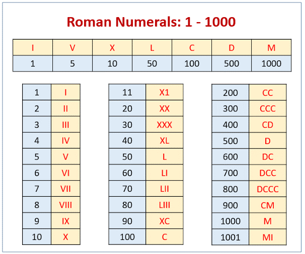

# Coding Challenge - 001 : Convert to Roman Numerals 

Purpose of the this coding challenge is to write a program that converts the given number to the Roman numerals.



## Learning Outcomes

At the end of the this coding challenge, students will be able to;

- analyze a problem, identify and apply programming knowledge for appropriate solution.

- design, implement `for` and `while` loops effectively in Python to solve the given problem.

- control loops effectively by using `if` and `control` statements.

- apply arithmetic operations on basic data types in Python.

- demonstrate their knowledge of string manipulations in Python.

- demonstrate their understanding of iterable data types by using effectively.

- demonstrate their knowledge of algorithmic design principles by using function effectively.

   
## Problem Statement

- Write program that converts the given number (between 1 and 3999) to the roman numerals. The program should convert only from numbers to Roman numerals, not vice versa and during the conversion following notes should be taken into consideration.

- Roman numerals are represented by seven different symbols: I, V, X, L, C, D and M.
   
```
Symbol        Value
- I             1
- V             5
- X             10
- L             50
- C             100
- D             500
- M             1000
```

- Two is written as II in Roman numeral, just two one's added together. Twelve is written as, XII, which is simply X + II. The number twenty seven is written as XXVII, which is XX + V + II.

- Roman numerals are usually written largest to smallest from left to right. However, the numeral for four is not IIII. Instead, the number four is written as IV. Because the one is before the five we subtract it making four. The same principle applies to the number nine, which is written as IX. 

- There are six instances where subtraction is used:
  - I can be placed before V (5) and X (10) to make 4 and 9. 
  - X can be placed before L (50) and C (100) to make 40 and 90. 
  - C can be placed before D (500) and M (1000) to make 400 and 900.

- Program should ask user for the input, after giving information text show as below.

```text
###  This program converts decimal numbers to Roman Numerals ###
(To exit the program, please type "exit")
Please enter a number between 1 and 3999, inclusively : 
```

- User input can be either integer or string, thus the input should be checked for the followings,

   - The input should be a decimal number within the range of 1 to 3999, inclusively.
   
   - If the input is less then 1 or greater then 3999, user should be warned and asked for input again.

   - If the input is string and can not be converted to decimal number, user should be warned and asked for input again.

- Program should run until the user types `exit` in case insensitive manner.
   
- Example for user inputs and respective outputs

```
Input       Output
-----       ------
3           III
9           IX
58          LVIII
1994        MCMXCIV
-8          "Not Valid Input !!!"
4500        "Not Valid Input !!!"
Ten         "Not Valid Input !!!"
Exit        "Exiting the program... Good Bye"
```
I have tested successfully all above suggested inputs and even more.  Yavuz Seckin
I agree with the alternate-5.py file.

